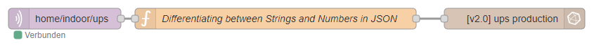

# ups-json-publisher
UPS Data Publisher for MQTT: Capture UPS details using upsc, format as JSON, and send to MQTT broker.

<!-- TOC -->

- [ups-json-publisher](#ups-json-publisher)
    - [Usage](#usage)
        - [Clone the Repository:](#clone-the-repository)
        - [Configure MQTT Broker Settings:](#configure-mqtt-broker-settings)
        - [Run the Script:](#run-the-script)
        - [Run the Script Periodically with Cron:](#run-the-script-periodically-with-cron)
    - [Node-RED transformation and InfluxDB import](#node-red-transformation-and-influxdb-import)
    - [License](#license)

<!-- /TOC -->

## Usage

### Clone the Repository
```
git clone https://github.com/filipnet/ups-json-publisher.git
cd ups-json-publisher
```

### Configure MQTT Broker Settings
Copy the example configuration file:
```
cp config.sh.example config.sh
```
Open config.sh in a text editor (e.g., nano, vim) and replace placeholders with your actual MQTT broker information.

### Run the Script
Make sure the required dependencies are installed: upsc (part of Network UPS Tools) and mosquitto_pub (part of Mosquitto MQTT client).

Run the script with the device name as an argument:
```
./mqtt_upsc_script.sh <device_name>
```
Important: Protect Your Configuration:

The config.sh file contains sensitive information. Make sure not to expose your credentials by adding config.sh to the .gitignore file. Never commit the actual config.sh to the repository.

### Run the Script Periodically with Cron
To run the script periodically, you can add a line to the system-wide crontab file. Open the crontab configuration:
```
sudo vim /etc/crontab
```
Add the following line to run the script every 5 seconds, suppressing the script output:
```
*/5 * * * * root /bin/bash /root/ups-json-publisher/mqtt_upsc_script.sh <device_name> >/dev/null 2>&1
```
For shorter time intervals you can also use the helper-script "run_upsc_script.sh". 

Replace <device_name> with the actual name of your UPS device.

- Mosquitto MQTT Client

## Node-RED transformation and InfluxDB import

If the scheduler and an MQTT input node have been configured, all data from the output of nutc should now arrive in the node-RED. Forwarding this data to InfluxDB is simple due to the JSON format. Since InfluxDB is a time series database it makes sense to pass the fields that have a numeric value to InfluxDB as a number and not as a string. For this I wrote a separate function.



Die Funktionion sieht dabei wie folgt aus:

```
// Node-RED Function Node
// Processes JSON input and returns a JSON differentiating between Strings and Numbers

var inputJSON = msg.payload;

function differentiateJSON(inputJSON) {
    var outputJSON = {};

    for (var key in inputJSON) {
        if (/^-?\d*\.?\d+$/.test(inputJSON[key])) {
            outputJSON[key] = parseFloat(inputJSON[key]); // Convert value to Number
        } else {
            outputJSON[key] = inputJSON[key];
        }
    }

    return outputJSON;
}

var outputJSON = differentiateJSON(inputJSON);
msg.payload = outputJSON;

return msg;
```

## License
This project is licensed under the BSD 3-Clause License.